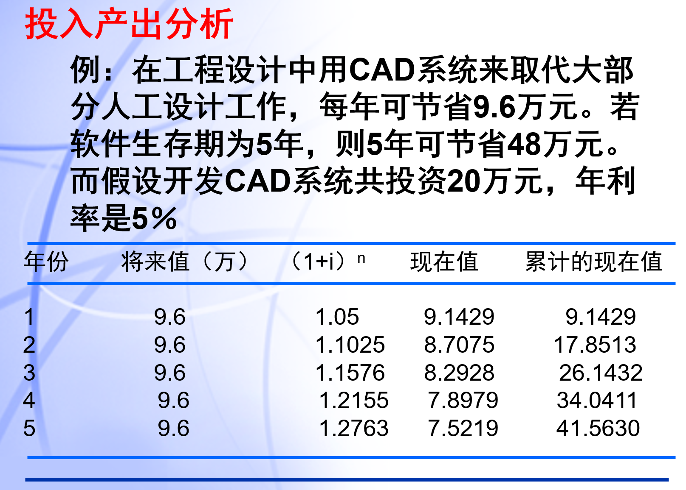

# 项目启动阶段的任务
1. 熟悉项目背景
2. 了解利益相关者
3. 研究(商业)需求和项目功能
4. 初步确定项目范围
5. 给出项目预算
6. 制定项目章程

---

## 1. 熟悉项目背景

---

## 2. 了解利益相关者

---

## 3. 研究(商业)需求和项目功能

---

## 4. 初步确定项目范围

---

## 5. 给出项目预算
**在做预算时需要考虑的因素和参考信息：**
以往的经验
历史信息
固定报价
标准成本 

---

## 6. 制定项目章程
**项目章程主要由以下要素构成：**
项目的正式名称、项目发起人、项目经理、项目目标、关于项目的开展原因、项目可交付成果、开展工作的基本时间安排（详细的时间安排在项目计划中列举）、项目资源（预算、成员、专家以及供应商）等。
**项目章程的主要作用：**
对项目进行完整定义。
确定项目发起人和项目经理。
确保项目经理对项目负责。
授权项目，从项目发起人的角度分配项目经理权力等。

---

# 项目启动过程
1. 需求识别
2. 项目识别
3. 项目研究
4. 项目决策
5. 项目立项
6. 启动会议

---

## 1. 需求识别
1. 信息化功能点需求
2. 对将来系统的非功能需求，如：
性能需求
环境需求
安全需求等
确定需求的优先次序。

---

## 2&&3. 可行性方案论证(项目识别与研究)
1. 项目投入产出评估的依据：进行投入产出分析
2. 产品选型的依据：可行性方案的制定是建立在业务的需求基础上，是不受任何产品影响的。一切从需要出发。
3. 实施方案的约束：可行性方案初步描绘了总体的业务方案与技术架构，而实施方案是可行性方案在各方面的细化。

---

### 番外：投入产出分析
1. 货币的时间价值：
设年利率为i, 现存入P元，则N年后可得钱数为$F=P(1+i)^n$
N年后能收入F元，那么这些钱现在的价值是$F=P/(1+i)^n$

---

### 番外：投入产出分析
- 投资回收期
它是衡量一个开发工程价值的经济指标。就是积累的经济效益等于最初投资所需要的时间。
上例中，引入CAD系统两年后，可以节省17.85万元，比最初投资还少2.15万元，但第三年可以省8.29万元，则 2.15/8.29=0.259，投资回收期是2.259年。
- 纯收入
工程纯收入也是另一个衡量价值的经济指标。是指整个生存周期之内系统的累计经济效益（折合成现值）与投资之差。上例中，纯收入是41.563－20＝21.563

---

### 可行性研究四方面
1. **经济可行性**：进行成本∕效益分析。从经济角度判断系统开发是否“合算”。
2. **技术可行性**：进行技术风险评价。包括：
- 实现风险分析：在给出限制范围内，能否设计和开发出满足要求的系统，并实现必要的功能和性能。
- 资源分析：研究开发系统的人员是否存在问题，可用于建立系统的其他资源，如硬件、软件等是否具备。
- 技术发展分析：系统技术是否符合相关软件技术的发展。

---

### 可行性研究四方面
3. **外部环境可行性**：如法律可行性， 指研究在系统开发过程中可能涉及的各种合同、侵权、责任以及各种与法律相抵触的问题。确定系统开发可能导致的任何侵权、妨碍和责任。政策、法规的可行性
4. **管理和操作的可行性**：如操作可行性：操作方式在用户组织内是否行得通。

---

